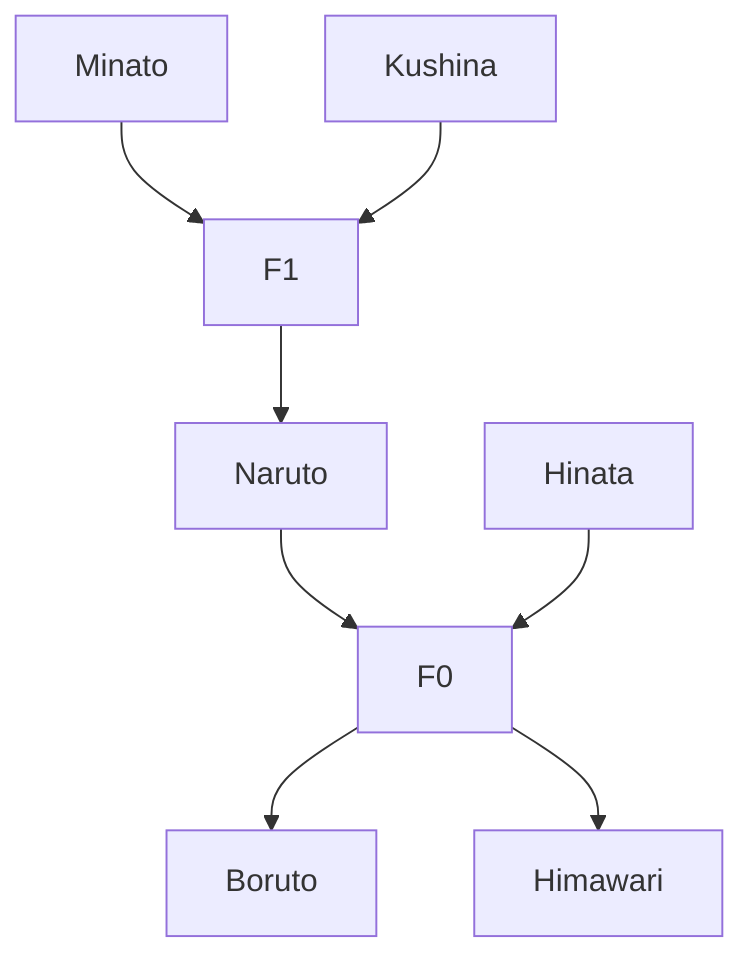

The code [`example.py`](https://github.com/SoleilVermeil/genealopy/blob/main/example.py) generates the following diagram.

```mermaid
graph TD
    Naruto --> F0
    Hinata --> F0
    F0 --> Boruto
    F0 --> Himawari
    Minato --> F1
    Kushina --> F1
    F1 --> Naruto
```
